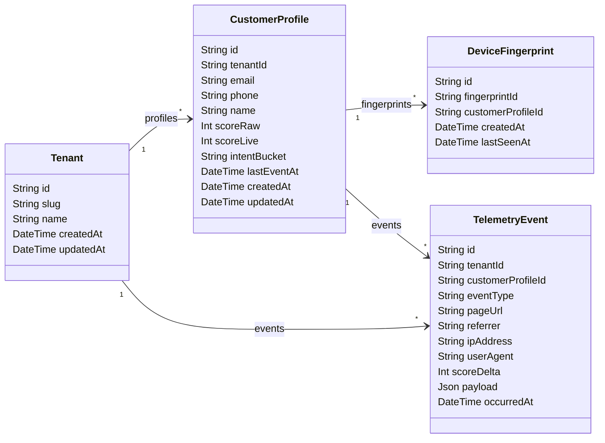

# Customer Data Platform (CDP) & Telemetry API Specification

This document serves as the single source of truth for the CDP and Telemetry service architecture, logic engines, and API endpoints.

---

## 1. Schema Model Definitions
Prisma ORM target models mapping to the PostgreSQL database:

---

## 2. Ingestion & Identity Resolution State Machine

Telemetry Ingestion (`POST /api/v1/telemetry/events`) invokes the Identity Resolution State Machine to handle anonymous-to-known user conversion, deduplication, and identifier conflict handling.

### Phase 1: Anonymous Ingest
* Event contains `fingerprintId`.
* Check if `DeviceFingerprint` exists in database.
* **If exists**: Return linked `CustomerProfile` and update `lastSeenAt` timestamp.
* **If not exists**: Create a new anonymous `CustomerProfile` (identifiers = null) and link `DeviceFingerprint`.
  * **Concurrency Protection**: Wrapped in a transaction. If a race condition occurs and another concurrent process inserts the fingerprint first (throwing unique violation P2002), the transaction rolls back, retries the query to fetch the existing profile, and returns it.

### Phase 2: Identifier Check & Merging
If the event contains `email` or `phone`:
* **Scenario A (New Identity)**: Email/phone does not match any profile. Update current profile with the new identifiers.
* **Scenario B (Existing Identity Match)**: Email/phone matches an existing profile:
  1. Re-link all fingerprints pointing to the anonymous profile to the matched profile.
  2. Re-link all historical telemetry events of the anonymous profile to the matched profile.
  3. Delete the temporary anonymous profile.
  4. Aggregate raw scores: `targetProfile.scoreRaw += anonymousProfile.scoreRaw`.
  5. Calculate live score and update intent bucket.
* **Scenario C (Identifier Conflict)**: Event contains *both* `email` and `phone` belonging to *two different profiles*:
  1. Merge phone-matched profile into email-matched profile (email takes precedence).
  2. Re-link all fingerprints and events from both sources to the email-matched profile.
  3. Delete both the temporary anonymous profile and the phone-matched profile.
  4. Sum all scores together on the email-matched profile.

---

## 3. Scoring, Decay & Demotion Engines

The platform computes visitor interest scoring dynamically, including grace periods and bucket progression.

### 1. Ingestion Score Upgrades (No-Downgrade Rules)
* Intent Buckets Hierarchy: `unclassified` < `research` < `comparison` < `active` < `emergency`
* Upon ingestion, bucket can **only upgrade** (e.g. `research` $\rightarrow$ `active`) or stay the same. It never demotes during telemetry ingestion.

### 2. Time-Based Score Decay
If `daysSinceLastEvent > gracePeriod`:
$$\text{scoreLive} = \text{scoreRaw} \times 0.5^{\frac{\text{daysSinceLastEvent} - \text{gracePeriod}}{\text{halfLife}}}$$

Decay configurations by intent:
| Intent Bucket | Grace Period (Days) | Half-Life (Days) |
| :--- | :---: | :---: |
| `emergency` | 1 | 2 |
| `active` | 3 | 14 |
| `comparison` | 7 | 30 |
| `research` | 14 | 60 |
| `unclassified` | 0 | 365 |

### 3. Cross-Session Bucket Demotions
When querying profiles or retrieving details, the system calculates score decay and evaluates if the profile should be demoted to a lower bucket.
* **Demotion Threshold Rules**:
  * `active` $\rightarrow$ demotes to `comparison` if `scoreLive < 35`
  * `comparison` $\rightarrow$ demotes to `research` if `scoreLive < 20`
  * `research` $\rightarrow$ demotes to `unclassified` if `scoreLive < 8`
  * `emergency` $\rightarrow$ does not demote.

---

## 4. API Endpoint Specifications

All endpoints are prefix-mounted at `/api/v1`.

### Ingestion & Maintenance
* **`POST /telemetry/events`**
  * Ingests event, creates/resolves customer identity, applies score delta. Auto-creates tenant if it doesn't exist.
* **`POST /tenants/:tenantSlug/clear`**
  * Clears all telemetry events, device fingerprints, and profiles belonging to the tenant.

### Queries & Timelines
* **`GET /tenants/:tenantSlug/events`**
  * Fetch paginated list of telemetry events for a tenant. Filters by `eventType` and JSON payload `sessionId`.
* **`GET /tenants/:tenantSlug/profiles`**
  * Fetch paginated, sorted, and filtered customer profiles. Returns dynamic metadata: `isAnonymous`, `sessionCount`, `decayPct`, `inGrace`, `wasDemoted`.
* **`GET /tenants/:tenantSlug/profiles/:id`**
  * Fetch details of a single customer profile with linked fingerprints.
* **`GET /tenants/:tenantSlug/profiles/:id/history`**
  * Retrieve chronological event timeline for the profile.

### System Analytics
* **`GET /analytics/aggregation`**
  * Exposes summaries, intent distributions, and clean features for model building.
